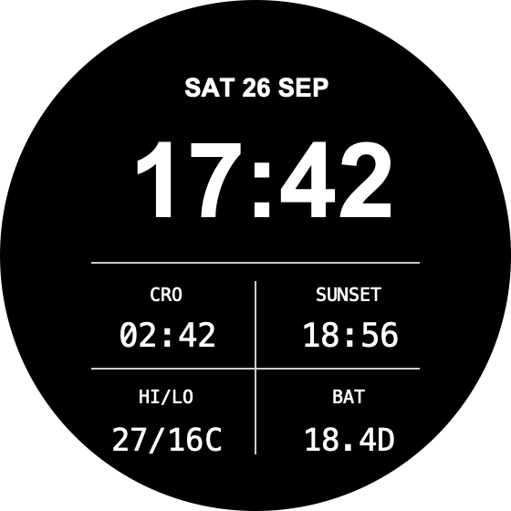

# Adria

A clean 24-hour watch face for Garmin tactix 7 / fenix 7X devices.



The main clock shows local time and date. Four smaller readings show Croatia time (`CRO`), local sunset, today's high/low, and Garmin's estimated battery time remaining. Sunset uses the watch's built-in value first. Weather needs the watch's normal Garmin sync; unavailable readings show dashes. The face does not start GPS or make network requests.

## Build

Install the [Connect IQ SDK](https://developer.garmin.com/connect-iq/sdk/) with the `fenix7x` device package and Java 17. Place your private developer key at `bin/developer_key.der`, then run:

```sh
make build      # bin/Adria.prg for direct installation
```

The Makefile uses Homebrew paths on macOS; adjust `JAVA_HOME` and `PATH` for another setup. Keep the signing key private and backed up for future updates. The key and build files are ignored by Git.

## Install without the store

Connect the watch by USB. On macOS, open its storage with an MTP file manager such as [OpenMTP](https://openmtp.ganeshrvel.com/); the tactix 7 may not appear in Finder. Copy **`bin/Adria.prg`** into **`GARMIN/Apps`** on the watch, replacing an older copy if present. Disconnect the watch, then select **Adria** in its watch-face menu.

## Privacy

Adria reads Garmin-provided time, weather, battery, and location or sunset data on the watch to draw the face. It does not send data to a server or require an account.
